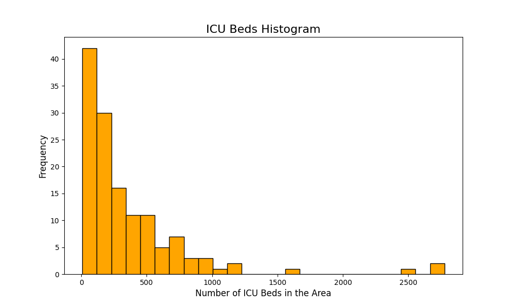

# Leo_Chen_Mini_2

Python script using Pandas for descriptive statistics

A summary report that includes summary statistics and a histogram will be generated during runtime.

Repository Contents:

* `main.py`

* `test_main.py`

* `.devcontainer`

* `hello.yml`

* `Makefile`

* `requirements.txt`

* `README.md`

## Setup Instructions

1. Open codespaces

2. Load the repository into codespaces

3. Run the Makefile command: `make all`

## Result

See generated summary_report.md for best result.

Attaching the histogram below for quick reference.

